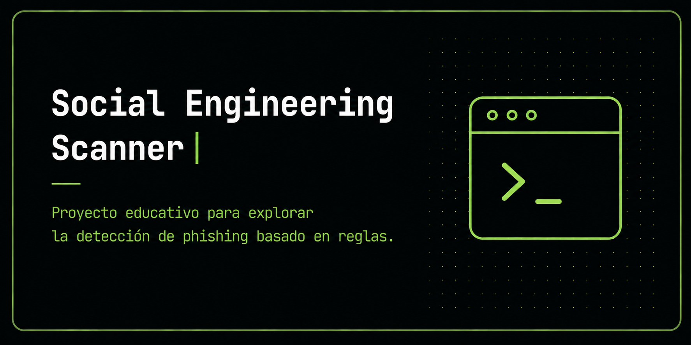

<p align="center">
  
</p>

# Social Engineering Scanner

Educational cybersecurity project focused on detecting potential social engineering attempts through rule-based analysis.

## Overview

Social Engineering Scanner is a simple Bash-based tool that analyzes messages by looking for signals associated with social engineering.

The project uses fixed rules and keywords to detect patterns such as urgency, authority, and promises of reward.

It is not a production-ready tool. It is an educational project created to understand how a rule-based detector works, why it can be useful in simple cases, and why it begins to fail when the context changes.

## Goal

With this project I wanted to understand:

- how a keyword-based detector works
- how a risk score can be assigned to a message
- what a false positive is
- why simple rules can be bypassed
- why context is difficult to capture with fixed rules
- why real-world systems require additional layers of analysis

## Main Features

- terminal-based message analysis
- detection of suspicious words and expressions
- rule-based risk scoring
- alerts for social engineering patterns
- step-by-step guided examples
- explanation of the result after each analysis
- runs without external dependencies

## How It Works

The script analyzes a message by searching for words, phrases, and patterns associated with potential social engineering attempts.

Whenever it finds a match, it adds points to the message score and displays an explanation of the detected signals.

The approach is intentionally simple:

```text
search for a pattern → add points → display alert
```

This makes it easy to understand why the system reaches a particular result.

That same simplicity also reveals its limitations. The script does not understand intent, legitimacy, or context. It only compares text against predefined rules.

## Detected Patterns

The scanner searches for signals related to three common social engineering patterns.

### Urgency

Looks for expressions that attempt to pressure someone into acting quickly.

Examples:

- today
- now
- urgent
- expires
- final notice

### Authority

Looks for signals where the message relies on a figure of authority or trust.

Examples:

- manager
- bank
- support
- human resources
- management

### Promise of Reward

Looks for messages that try to attract attention by offering something appealing.

Examples:

- prize
- bonus
- reward
- gift
- promotion

These patterns alone do not prove that a message is fraudulent. They only indicate signals that may increase its risk.

## Included Scenarios

The project includes four progressively designed examples.

Each scenario is presented step by step: first the message, then the analysis, followed by the result, and finally an explanation. The pace is controlled by pressing Enter.

### 1. Clean Email

A legitimate message used as a baseline.

The goal is to verify that the scanner does not classify everything it analyzes as a threat.

### 2. CEO Fraud

A message in which someone impersonates a figure of authority and requests urgent action.

This case demonstrates when rules can work well, especially when the attacker uses the words the system expects to find.

### 3. False Positive

A legitimate message that triggers suspicious signals.

This case illustrates an important problem: if a detector makes too many mistakes, people may stop trusting its alerts.

### 4. Bypass

A fraudulent message intentionally written to avoid the scanner's rules.

This case demonstrates that fixed rules are predictable. If someone understands how the detector works, they can attempt to write the message in a way that avoids triggering alerts.

## Installation and Usage

Clone the repository:

```bash
git clone https://github.com/fabianubilla/social-engineering-scanner.git
cd social-engineering-scanner
```

Grant execution permissions:

```bash
chmod +x scanner.sh
```

Run the scanner:

```bash
./scanner.sh
```

Requires Bash. Works on Linux and macOS.

No external dependencies are required.

## Project Structure

```text
social-engineering-scanner/
├── scanner.sh
└── README.md
```

## Main File

### `scanner.sh`

Main project script.

Contains the detection logic, example messages, scoring system, and the explanations displayed during execution.

## Limitations

- Does not understand the context of the message
- May generate false positives
- May miss fraudulent messages that avoid the expected keywords
- Does not perform deep link analysis
- Does not inspect email headers
- Does not analyze attachments
- Does not verify the sender's real identity
- The rules can be bypassed if someone understands how they work
- Does not use machine learning or language models

## What I Learned

This project helped me understand that detecting phishing or social engineering using only keywords can work in obvious cases, but fails when the wording of the message changes.

It also allowed me to observe how false positives appear. A legitimate message may contain words such as "urgent" or "expires today" without being a scam.

The main lesson was that adding more words to a list does not make the system understand the message any better. It may improve some specific cases, but it can also introduce new errors.

Building this scanner helped me better understand the limitations of fixed rules and why real-world systems usually combine multiple layers of analysis.

## Next Step

The limitations of this project led to the development of NotPhish.

NotPhish keeps the idea of analyzing suspicious signals, but adds a web interface, additional rules, a machine learning model, and a hybrid system that combines multiple results.

Social Engineering Scanner was my first approach to the problem. NotPhish emerged from the questions that remained after testing it.

## Technologies

Bash · grep · sed · tr

## AI-Assisted Development

This project was developed with significant support from Claude by Anthropic, particularly in writing the code, structuring the script, and making several implementation decisions.

I do not present this repository as a tool built entirely by hand. I share it as an educational project and as part of my real learning process in cybersecurity and computer science.

My role was to define what I wanted to explore, test the program, review its results, identify situations where it failed, refine ideas, evaluate its limitations, and progressively understand how the scanner's logic worked.

Working on this project helped me learn more than simply reading theory because I was able to experiment with a real detector, observe when it succeeded, when it failed, and why simple rules are not enough to solve the problem completely.

## License

MIT
