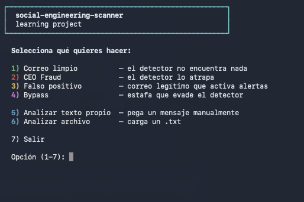

# ¿Se puede detectar phishing solo buscando palabras sospechosas?

Este proyecto intenta hacerlo.

Y falla.

Ese fracaso es justamente la lección.

---

# Detectar phishing con reglas simples

A muchos de nosotros, cuando empezamos a aprender ciberseguridad,
nos pasa algo parecido:

vemos conceptos como phishing, ingeniería social, falsos positivos o bypass…
pero entenderlos de verdad cuesta más cuando solo los leemos en teoría.

Este proyecto nació de esa idea: construir un detector simple para ver desde dentro
cómo funcionan las reglas, por qué parecen útiles al inicio y dónde empiezan a fallar.

---

## Qué vamos a aprender

- Cómo funciona un detector basado en reglas
- Por qué aparecen falsos positivos y bypass
- Por qué el contexto es tan difícil de detectar
- Por qué se necesitan enfoques más avanzados

---

## La idea detrás del proyecto

Cuando uno empieza en seguridad suele pensar algo como:

> “Si un correo dice urgente, banco o transferencia,
> probablemente es phishing.”

Y honestamente, tiene sentido.

Este proyecto funciona exactamente así:
busca patrones sospechosos usando reglas simples.

El problema aparece cuando empiezas a probar mensajes reales.

Ahí empiezan a aparecer cosas incómodas:

- correos legítimos marcados como fraude
- ataques que evaden el detector fácilmente
- mensajes ambiguos
- problemas de contexto

Y ahí es donde realmente empieza el aprendizaje.

---

## ¿Por qué Bash?

Porque Bash permite ver las reglas sin esconderlas detrás de frameworks.

El detector no usa modelos entrenados ni análisis semántico:
solo texto, patrones y lógica básica.

Eso ayuda a entender desde cero cómo funciona una detección basada en reglas
y por qué eventualmente deja de ser suficiente.

---

# Cómo usarlo

```bash
git clone https://github.com/fabianubilla/social-engineering-scanner.git

cd social-engineering-scanner

chmod +x scanner.sh

./scanner.sh
```



Funciona en:

- Linux
- macOS
- WSL

Sin dependencias externas.

---

# Cómo funciona

El script analiza mensajes buscando patrones asociados a ingeniería social.

Por ejemplo:

- urgencia
- autoridad
- presión
- promesas
- solicitudes sensibles

Cuando encuentra ciertas palabras o expresiones:

- suma puntos
- activa alertas
- clasifica el riesgo

Es un enfoque extremadamente simple.

Y justamente por eso sirve para aprender.

---

# Los cuatro ejemplos guiados

El proyecto incluye cuatro escenarios pensados para mostrar problemas reales de detección.

El script muestra:

```text
mensaje → análisis → resultado → explicación
```

La idea es ir viendo paso a paso qué detecta,
qué no detecta y por qué ocurren ciertos errores.

---

## 1. Correo limpio — la línea base

Un newsletter legítimo.

El detector no encuentra nada.

Y esa es la respuesta correcta.

### Lo importante

Antes de detectar fraude,
primero necesitamos entender cómo se ve un mensaje normal.

---

## 2. CEO Fraud — cuando las reglas funcionan

Un atacante finge ser un gerente y pide una transferencia urgente.

El detector logra marcarlo porque el mensaje usa exactamente las palabras
que las reglas esperan encontrar.

### Lo importante

Las reglas funcionan…
mientras el atacante no se adapte.

---

## 3. Falso positivo — cuando el detector se equivoca

Ahora aparece un correo legítimo de un banco.

El detector activa alertas.

Pero el mensaje no es fraude.

### Lo importante

Si un sistema se equivoca demasiado:

- las personas dejan de confiar
- empiezan a ignorar alertas
- el detector pierde utilidad real

---

## 4. Bypass — cuando el atacante gana

Ahora aparece una estafa escrita específicamente para evadir este detector.

La manipulación sigue ahí.

Pero las palabras cambiaron.

Resultado:

el detector no encuentra nada.

### Lo importante

Las reglas fijas son predecibles.

Y cualquier sistema predecible puede ser evadido.

---

# Patrones psicológicos detectados

La ingeniería social no funciona solo por tecnología.

Funciona porque empuja a las personas a decidir rápido,
obedecer autoridad o bajar la guardia.

Este script detecta tres patrones básicos:

## Urgencia

Reducir el tiempo de análisis.

Ejemplos:

- “última oportunidad”
- “acción inmediata”
- “tu cuenta será suspendida”

## Autoridad

Fingir legitimidad o poder.

Ejemplos:

- gerente
- banco
- soporte técnico
- RRHH

## Beneficio

Bajar defensas ofreciendo algo atractivo.

Ejemplos:

- premios
- bonos
- descuentos
- reembolsos

---

# El verdadero problema: contexto

Herramientas como `grep` no entienden significado.

Solo comparan texto.

Para una regla simple, estas dos frases pueden activar alertas parecidas:

```text
“Tu cuenta será suspendida. Ingresa aquí para verificar tus datos.”
```

y

```text
“Te recordamos que tu suscripción vence mañana.”
```

Pero no significan lo mismo.

La primera presiona y pide una acción sensible.
La segunda solo informa una fecha.

El sistema no comprende:

- intención
- legitimidad
- contexto
- si la solicitud tiene sentido

Y ese es uno de los motivos por los que detectar phishing real es tan difícil.

---

# Por qué las reglas no escalan bien

Durante años se intentó mejorar este tipo de detección agregando:

- más palabras
- más excepciones
- más listas negras

El problema es que el detector se vuelve cada vez más complejo…
sin realmente entender el mensaje.

Ahí aparece la necesidad de otros enfoques.

---

# Qué apareció después

Cuando las reglas simples empiezan a fallar, aparecen otros enfoques.

## Machine Learning

Aprender patrones completos en vez de buscar palabras exactas.

## LLMs

Analizar contexto, intención y significado.

## SPF / DKIM / DMARC

Verificar si el remitente realmente es quien dice ser.

También existe otra capa importante: los headers del correo,
donde aparecen metadatos como dominios, rutas de envío y autenticación.

La idea central es esta:

> detectar phishing no es solo encontrar palabras sospechosas.
> Es combinar señales.

---

# Proyecto relacionado

## [NotPhish](https://github.com/fabianubilla/notphish)

Un proyecto donde la detección ya no depende solamente de palabras,
sino de múltiples señales combinadas.

---

# Herramientas usadas

- Bash
- grep
- sed
- tr

Herramientas estándar de Unix/Linux.

Sin frameworks.
Sin dependencias.
Sin abstracciones complejas.

---

# Sobre este proyecto

Soy estudiante de ingeniería informática y ciberseguridad. A la fecha de este proyecto, mis conocimientos de programación están en una etapa inicial: fundamentos, lógica y exploración práctica.

Por eso, este proyecto fue construido usando Claude (Anthropic) como herramienta de desarrollo y aprendizaje. La IA tuvo un rol importante en la implementación, en decisiones técnicas y en la generación del código.

Mi rol fue definir qué quería explorar, probar el programa, iterar ideas, evaluar propuestas, descartar lo que no tenía sentido y entender progresivamente cómo funcionaba el sistema.

Lo comparto como parte de un proceso real de aprendizaje, porque construir algo concreto me ayudó mucho más que solo leer teoría.

Espero que también pueda servirle a otros estudiantes que estén empezando y quieran entender estos conceptos desde un ejemplo simple, imperfecto y fácil de probar.
